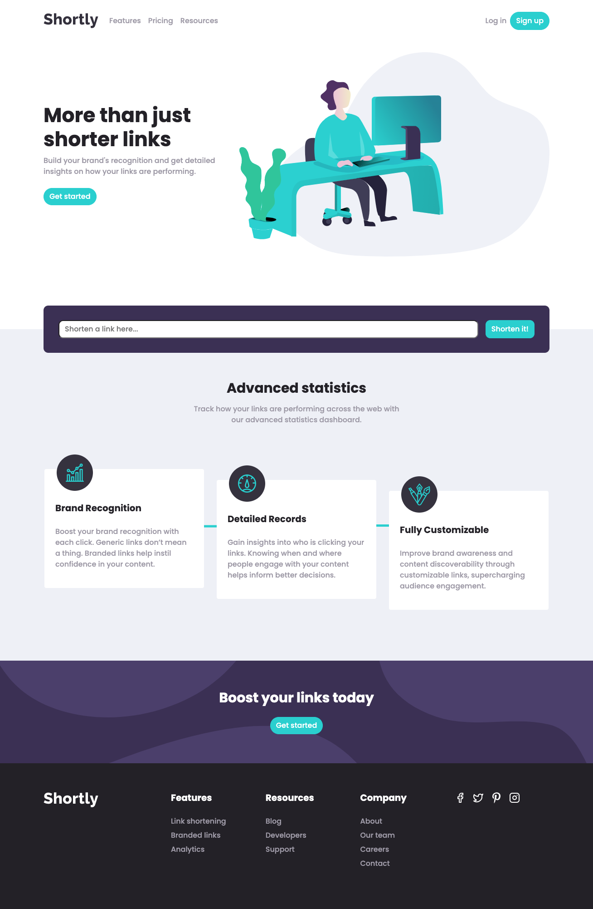
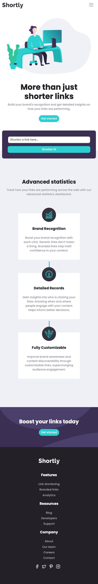

# Frontend Mentor - Shortly URL shortening API Challenge solution

This is a solution to the [Shortly URL shortening API Challenge challenge on Frontend Mentor](https://www.frontendmentor.io/challenges/url-shortening-api-landing-page-2ce3ob-G). Frontend Mentor challenges help you improve your coding skills by building realistic projects.

## Table of contents

-   [Overview](#overview)
    -   [The challenge](#the-challenge)
    -   [Screenshot](#screenshot)
    -   [Links](#links)
-   [My process](#my-process)
    -   [Built with](#built-with)
    -   [What I learned](#what-i-learned)
    -   [Useful resources](#useful-resources)
-   [Author](#author)

## Overview

### The challenge

Users should be able to:

-   View the optimal layout for the site depending on their device's screen size
-   Shorten any valid URL
-   See a list of their shortened links, even after refreshing the browser
-   Copy the shortened link to their clipboard in a single click
-   Receive an error message when the `form` is submitted if:
    -   The `input` field is empty

### Screenshot

### Links

-   [GitHub repo](https://github.com/darryncodes/url-shortening-api)
-   [Live URL](https://darryncodes.github.io/url-shortening-api/)

## My process

### Built with

-   Mobile-first workflow
-   Semantic HTML5 markup
-   Flexbox
-   CSS / SCSS
-   Create React App
-   [React](https://reactjs.org/) - JS library
-   [React Router](https://v5.reactrouter.com/web/guides/quick-start)
-   [React - Bootstrap](https://react-bootstrap.netlify.app/)
-   [React Icons](https://react-icons.github.io/react-icons/)

### What I learned

-   TBC

### Useful resources

-   [Firebase - Back to the Basics](https://www.youtube.com/watch?v=q5J5ho7YUhA)
-   [React Authentication Crash Course With Firebase And Routing](https://www.youtube.com/watch?v=PKwu15ldZ7k)
-   [Tempmail](https://temp-mail.org/en/)
-   [React Router - Navigate](https://reactrouter.com/en/main/components/navigate)

## Author

-   Work in progress portfolio site - [darryn-codes](https://www.darryncodes.co.uk)
-   Frontend Mentor - [@darryncodes](https://www.frontendmentor.io/profile/darryncodes)
-   Twitter - [@darryncodes](https://twitter.com/darryncodes)
